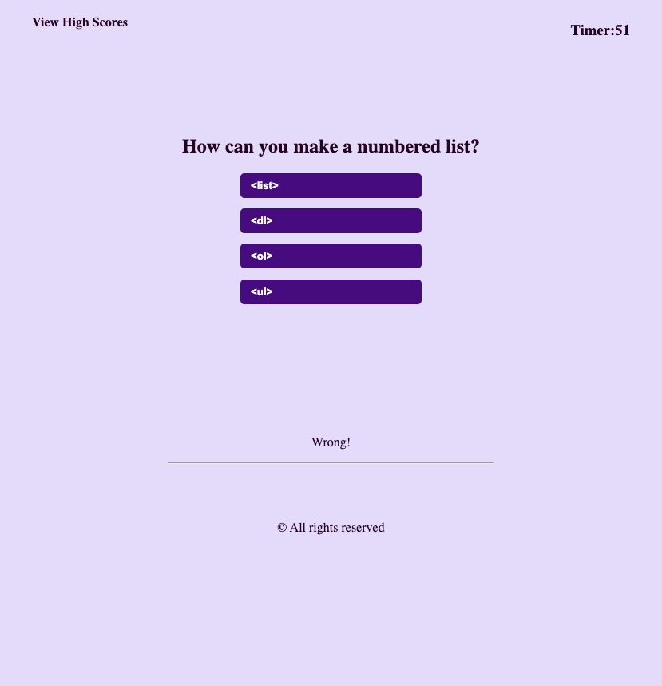

# Code Quiz Challenge

## Description

If you're seeking to grasp the basic principles of HTML, CSS, and JavaScript, you can enhance your understanding through this timed code quiz challenge. The quiz begins with a timer set at 90 seconds and consists of ten questions, each offering four options to choose from. For every incorrect answer, 15 seconds are deducted from the timer. The game concludes when one of the following conditions is met:

1. The user responds to all ten questions.
2. The timer reaches 0.

## Installation

This application is web-based, eliminating the need for any installation process.

## Usage

Screenshots shots from the app.

## Credits

All the questions in this application have been sourced from the HTML, CSS, and JavaScript quizzes provided by w3Schools.

- [W3Schools](https://www.w3schools.com/quiztest/)

## Badges

 
 

 

## Features

- The app has the ability to identify the right and wrong answers.
- Can persist data, like name or initials and scores.
- User can delete the hight score data at theor own will.

## Important Links

- [Github Repository](https://github.com/sucheta90/quiz_challenge)
- [Live Site](https://sucheta90.github.io/quiz_challenge/)
